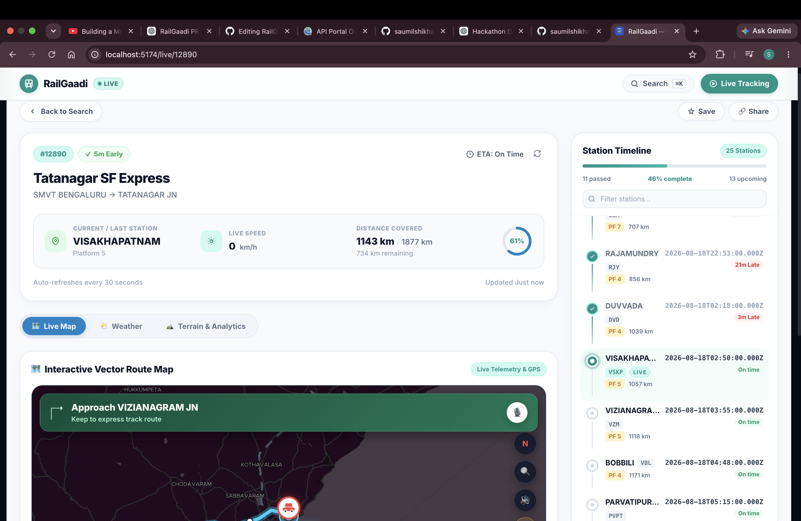
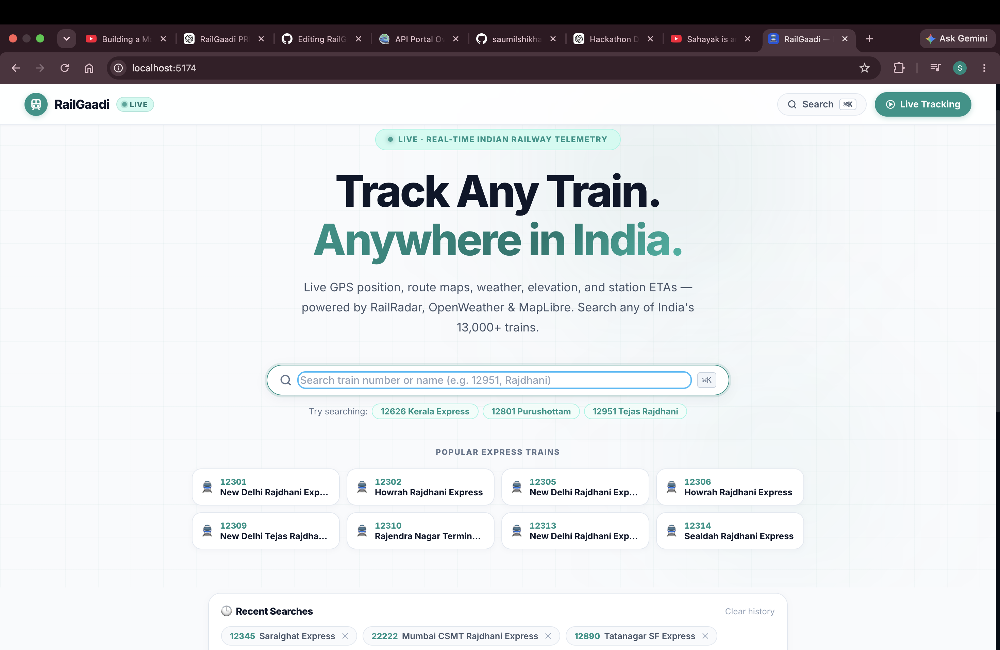
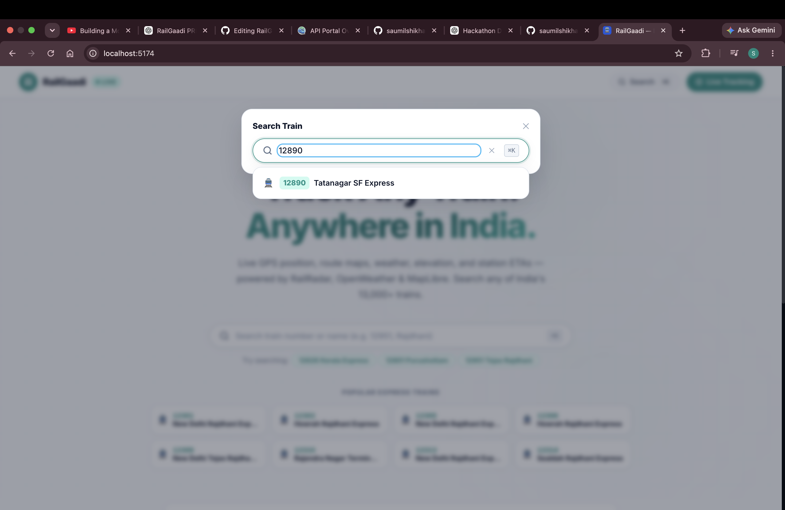
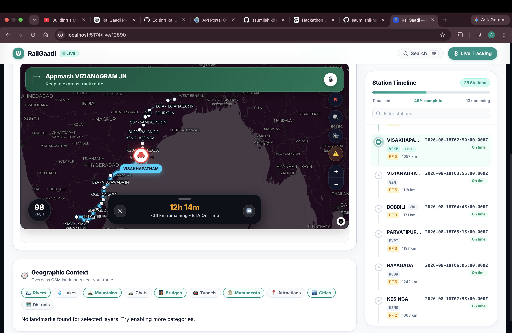
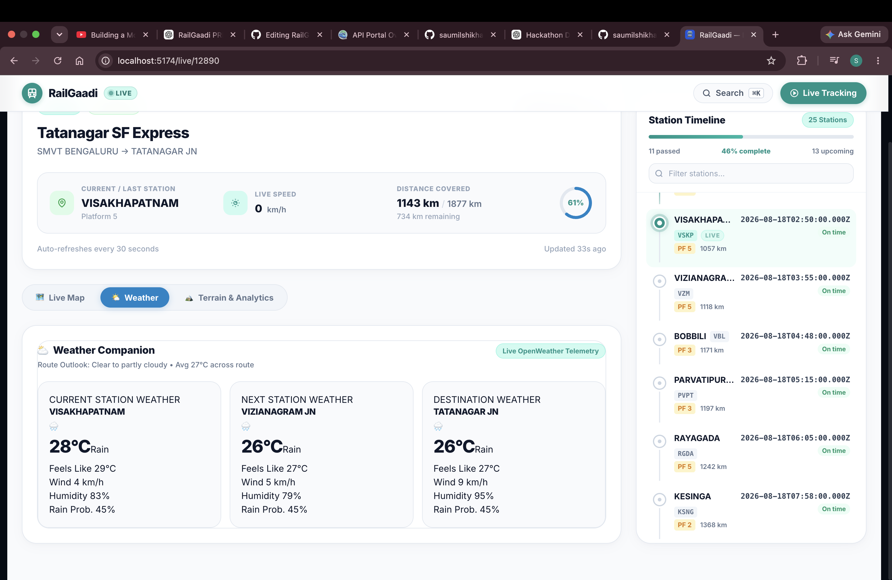
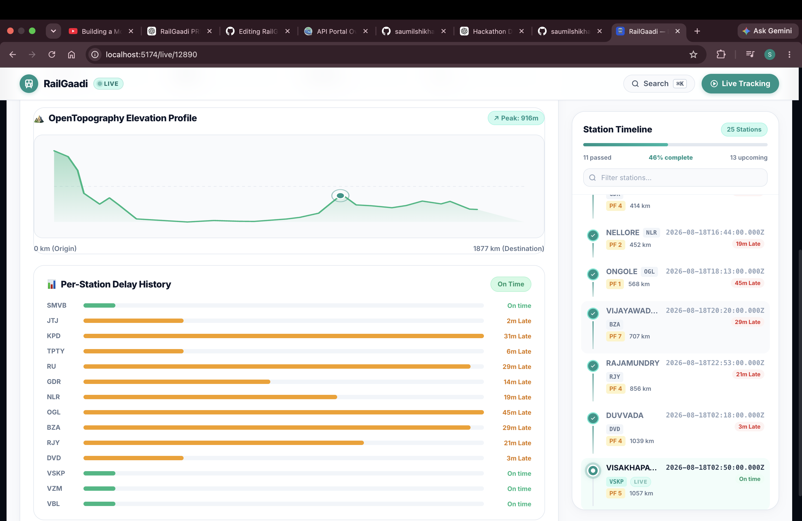

# RailGaadi 🚆

> **Real-time Indian Railway telemetry dashboard** — live GPS, route maps, weather, elevation, and station ETAs for any of India's 13,000+ trains.

<p align="center">
  
</p>

<p align="center">
  A real-time railway intelligence dashboard for exploring train journeys across India.
</p>


[](https://react.dev)
[](https://maplibre.org)
[](https://www.typescriptlang.org)

---

## 🚆 What is RailGaadi?

RailGaadi is a real-time Indian railway intelligence dashboard built to provide a richer visual understanding of train journeys.

Instead of displaying only conventional train-running information, RailGaadi combines live railway telemetry with:

- 🗺️ Interactive vector maps
- 📍 Live train location
- 🚉 Station-by-station journey progress
- ⏱️ Delay and ETA information
- ⛅ Weather conditions
- ⛰️ Terrain and elevation data
- 🧭 Geographic context around the railway route

The application is designed around a simple idea:

> **Turn railway telemetry into a visual journey experience.**

Train data is dynamically fetched based on the selected train number, while supporting services provide additional geographic, weather, and terrain information.

---

## ⚙️ How It Works

```text
User searches for a train
        ↓
RailGaadi Backend
        ↓
Railway / Weather / Terrain APIs
        ↓
Data normalization + caching
        ↓
React Dashboard
        ↓
Live map + train telemetry
+ station timeline
+ weather
+ elevation
+ geographic context

---

## ✨ Features

| Feature | Technology |
|---|---|
| 🗺️ Interactive Vector Map | MapLibre GL + MapTiler `dataviz-dark` tiles |
| 📡 Live Train Telemetry | RailRadar API (GPS, speed, delay, ETA) |
| ⛅ Station Weather | OpenWeather API (current, next, destination) |
| ⛰️ Terrain & Elevation | OpenTopography SRTM with hover inspection |
| 🧭 Geographic Context | Overpass OSM (rivers, mountains, bridges, monuments) |
| 🚉 Station Timeline | Full route schedule with completion progress & search filter |
| 💾 Favourites & History | Local storage, persistent across sessions |
| 🔗 Shareable Links | `/live/{trainNumber}` with tab hash persistence |

---
## 📸 Screenshots

### 🏠 Homepage

<p align="center">
  
</p>

### 🔎 Train Search

<p align="center">
  
</p>

### 📡 Live Train Tracking

<p align="center">
  
</p>

### 🗺️ Interactive Vector Map

<p align="center">
  
</p>

### ⛅ Weather Companion

<p align="center">
  
</p>

### ⛰️ Terrain & Elevation

<p align="center">
  
</p>

---

## 🌐 Demo

> 🚧 A public demo is currently being prepared.

For now, RailGaadi can be run locally using the setup instructions below.

---

## ⭐ Key Highlights

- 🔎 Search trains by number or name
- 📡 Fetch live train telemetry from RailRadar
- 📍 Display the train's current geographic position
- 🗺️ Visualize journeys using MapLibre GL and MapTiler
- 🚉 Track station-by-station journey progress
- ⛅ View weather around relevant stations
- ⛰️ Explore terrain and elevation along the journey
- 🧭 Display geographic context using OpenStreetMap data
- 🔗 Open shareable train tracking URLs using `/live/{trainNumber}`
- 💾 Persist favourites and recently viewed trains locally
- 🔄 Refresh live telemetry without recreating the map

---

## 🚀 Quick Start

### Prerequisites
- Node.js 18+
- Two terminal windows (frontend + backend)

### 1. Clone & Install

```bash
git clone https://github.com/saumilshikhar-commits/RailGaadi.git
cd RailGaadi
npm install
cd server && npm install && cd ..
```

---

### 2. Configure Environment Variables

RailGaadi uses environment variables for external API services.

#### Frontend

Copy the example environment file:

```bash
cp .env.example .env
```

Then open `.env` and add your own API keys:

```env
VITE_API_URL=http://localhost:3001
VITE_MAPTILER_API_KEY=your_maptiler_api_key
VITE_GEOAPIFY_API_KEY=your_geoapify_api_key
```

#### Backend

Create a file named:

```text
server/.env
```

Then add:

```env
NODE_ENV=development
PORT=3001

RAILRADAR_API_KEY=your_railradar_api_key
OPENWEATHER_API_KEY=your_openweather_api_key
OPENTOPOGRAPHY_API_KEY=your_opentopography_api_key
MAPTILER_API_KEY=your_maptiler_api_key

ALLOWED_ORIGINS=http://localhost:5173
RATE_LIMIT_SEARCH=30
RATE_LIMIT_LIVE=60
```

> ⚠️ **Important:** Never commit `.env` or `server/.env` to GitHub. Keep your API keys private and use `.env.example` to document the required variables.

---

### 3. Start Development Servers

**Terminal 1 — Backend:**
```bash
cd server
npm run dev
# API running at http://localhost:3001
```

**Terminal 2 — Frontend:**
```bash
npm run dev
# App running at http://localhost:5173
```

---

## 🔑 API Keys

RailGaadi uses external APIs for live railway telemetry, interactive maps, weather, terrain and geographic services.

| Provider | Environment Variable | Purpose |
|---|---|---|
| RailRadar | `RAILRADAR_API_KEY` | Live train telemetry |
| MapTiler | `VITE_MAPTILER_API_KEY` | Interactive vector maps |
| OpenWeather | `OPENWEATHER_API_KEY` | Weather information |
| OpenTopography | `OPENTOPOGRAPHY_API_KEY` | Terrain and elevation |
| Geoapify | `VITE_GEOAPIFY_API_KEY` | Geographic services |
| Overpass OSM | No key required | OpenStreetMap geographic data |

### Getting API Keys

- [RailRadar](https://railradar.in/)
- [MapTiler](https://www.maptiler.com/)
- [OpenWeather](https://openweathermap.org/api)
- [OpenTopography](https://opentopography.org/)
- [Geoapify](https://www.geoapify.com/)

> 🔐 **Security:** Never commit real API keys to the repository. Keep API keys in local `.env` files and use `.env.example` to document required variables.

---

## 🏗️ Architecture

RailGaadi follows a provider-based architecture where external data sources are isolated behind backend adapters.

This allows railway, weather, terrain and geographic services to be consumed through a consistent internal interface.

```text
                         ┌──────────────────┐
                         │   React Client   │
                         │ TypeScript + Vite│
                         └────────┬─────────┘
                                  │
                                  ▼
                         ┌──────────────────┐
                         │   Express API    │
                         │   Node + TS      │
                         └────────┬─────────┘
                                  │
             ┌────────────────────┼────────────────────┐
             ▼                    ▼                    ▼
       ┌────────────┐      ┌────────────┐      ┌──────────────┐
       │ RailRadar  │      │ OpenWeather│      │ OpenTopo-    │
       │ Telemetry  │      │ Weather    │      │ graphy       │
       └────────────┘      └────────────┘      └──────────────┘
                                  │
                                  ▼
                         ┌──────────────────┐
                         │ Overpass / OSM   │
                         │ Geographic Data  │
                         └──────────────────┘

---

## 📡 API Endpoints

| Method | Endpoint | Description |
|---|---|---|
| GET | `/api/health` | Server health, uptime, memory, provider status |
| GET | `/api/v1/trains/search?q={query}` | Search trains by name or number |
| GET | `/api/v1/trains/{id}/journey` | Full route, stations, schedule |
| GET | `/api/v1/trains/{id}/live` | Live GPS, speed, delay, ETA |
| GET | `/api/v1/trains/{id}/weather` | Weather at current/next/destination |
| GET | `/api/v1/trains/{id}/elevation` | Terrain elevation profile along route |
| GET | `/api/v1/trains/{id}/context?categories=river,mountain` | OSM geographic features |
| GET | `/api/v1/dev/config` | Provider & circuit breaker states |

---

## 🧪 Running Tests

```bash
cd server

# Integration tests (requires dev server running on :3001)
node --test --import tsx/esm src/__tests__/api.test.ts
```

---

## 🏗️ Production Build

```bash
# Frontend
npm run build   # outputs to /dist

# Backend
cd server && npm run build  # compiles TypeScript to /dist
```

---

## 🛡️ Resilience Features (M6)

- **Circuit Breakers** — each provider (RailRadar, OpenWeather, OpenTopography, Overpass) trips independently after 3 failures, auto-recovers after 30s
- **Request Tracing** — every request gets `X-Request-Id` and `X-Response-Time` headers
- **Rate Limiting** — search: 30 req/min, live telemetry: 60 req/min
- **TTL Caching** — live data: 15s, journey: 5min, weather: 15min, elevation: 24h, geo context: 1h

---

## 🎨 Design System

- **Dark theme** — `#060b14` background, `#38bdf8` brand cyan
- **Typography** — Inter (Google Fonts)
- **Accessibility** — WCAG 2.2 AA: ARIA roles, live regions, reduced-motion, focus-visible
- **Animations** — micro-animations with `prefers-reduced-motion: reduce` fallback

---

## 🤝 Contributing

Contributions, suggestions and improvements are welcome.

### 1. Fork the repository

Fork the RailGaadi repository on GitHub.

### 2. Clone your fork

```bash
git clone https://github.com/YOUR_USERNAME/RailGaadi.git
cd RailGaadi
```

### 3. Create a branch

```bash
git checkout -b feature/your-feature
```

### 4. Install dependencies

```bash
npm install
cd server && npm install && cd ..
```

### 5. Configure environment variables

Create your local `.env` and `server/.env` files using the example configuration provided above.

Never commit real API keys.

### 6. Make your changes

Implement your feature or fix and test it locally.

### 7. Build the project

```bash
npm run build
cd server && npm run build
```

### 8. Commit your changes

```bash
git add .
git commit -m "feat: describe your change"
```

### 9. Push your branch

```bash
git push origin feature/your-feature
```

### 10. Open a Pull Request

Open a Pull Request on GitHub describing your changes and testing performed.

---

## 🙏 Acknowledgements

RailGaadi is built using and integrating several open data sources and developer platforms:

- [RailRadar](https://railradar.in/) — railway telemetry
- [MapTiler](https://www.maptiler.com/) — vector map tiles
- [MapLibre GL JS](https://maplibre.org/) — interactive map rendering
- [OpenStreetMap](https://www.openstreetmap.org/) — geographic data
- [Overpass API](https://overpass-api.de/) — OpenStreetMap data queries
- [OpenWeather](https://openweathermap.org/) — weather information
- [OpenTopography](https://opentopography.org/) — terrain and elevation data
- [Geoapify](https://www.geoapify.com/) — geographic services

---
## 📄 License

This project is licensed under the MIT License. See the [LICENSE](LICENSE) file for details.

---

<p align="center">
  Built with ❤️ and TypeScript for Indian railway travellers.
</p>
